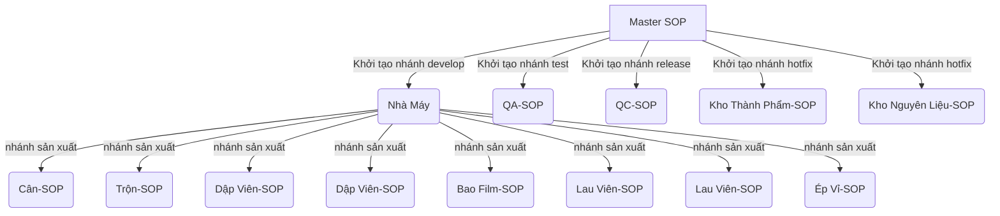
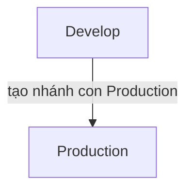
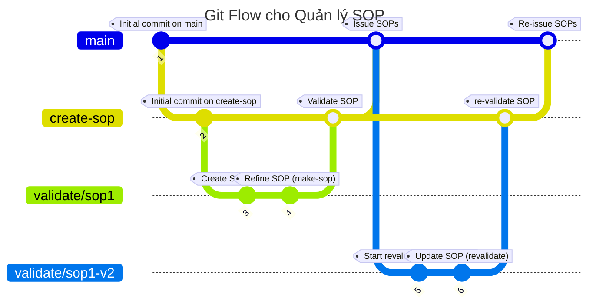

## Git Branching cho Công Ty Dược Phẩm

### Câu hỏi:

Dựa vào bài viết https://medium.com/@sreekanth.thummala/choosing-the-right-git-branching-strategy-a-comparative-analysis-f5e635443423

Hãy áp dụng chiến lược git-flow, git branching vào hệ thống quản lý phiên bản SOP ("SOP" stands for Standard Operating Procedure - Tiếng Việt gọi là "Qui Trình Thao Tác Chuẩn") của một công ty dược phẩm. Lấy ví dụ: SOP cho cân nguyên liệu, SOP vận hành máy dập viên, SOP vận hành máy Ép vỉ. gồm có các nhánh (branch):
1. make-sop(Tạo SOP)
2. validate (thẩm định SOP)
3. Issue (ký và banh hành SOP)
4. Revalidate (tái thẩm định SOP)
Nhân sự liên quan: nhân viên vận hành, người thẩm định, người ký ban hành, người thẩm định lại.

### Grok 3 (Deepsearch)


---
## Git Branching cho Công Ty Dược Phẩm

Git branching là một tính năng mạnh mẽ của Git cho phép bạn tạo ra các nhánh (branch) riêng biệt để phát triển các tính năng mới, kiểm thử, chuẩn bị phát hành, hoặc sửa lỗi mà không ảnh hưởng đến nhánh chính (main branch). Dưới đây là hướng dẫn cơ bản về các loại nhánh và cách đặt tên:

### Các loại nhánh cơ bản:
- **develop**: Dùng để phát triển các tính năng mới.
- **test**: Dùng để kiểm thử các tính năng.
- **release**: Dùng để chuẩn bị phát hành.
- **hotfix**: Dùng để sửa lỗi gấp.

### Cách đặt tên:
- **Commit**: Sử dụng tên mô tả rõ ràng, đúng chuẩn.
- **Branch**: Tuân theo tiêu chuẩn đặt tên để đảm bảo dễ theo dõi và phối hợp.

### Phân Quyền Cho Mỗi Bộ Phận:
- **Nhà Máy**: Quản lý nhánh develop và các nhánh con như Cân-SOP, Trộn-SOP, Dập Viên-SOP, Bao Film-SOP, Lau Viên-SOP, Ép Vỉ-SOP.
- **QA-SOP**: Quản lý nhánh test để kiểm thử và đảm bảo chất lượng.
- **QC-SOP**: Quản lý nhánh release để chuẩn bị phát hành và quản lý phiên bản.
- **Kho Thành Phẩm-SOP** và **Kho Nguyên Liệu-SOP**: Quản lý nhánh hotfix để sửa lỗi khẩn cấp.

Sử dụng các lệnh sau để tạo nhánh:

```bash
git branch develop
git branch test
git branch release
git branch hotfix
```

- Cấu trúc thư mục



## Creating Production Sub-branch in Develop

From the develop branch, create a sub-branch named production to hold deployment-ready features.

### Commands

```bash
git checkout develop
git checkout -b production
```

### Branch Structure Diagram



- Workflow



