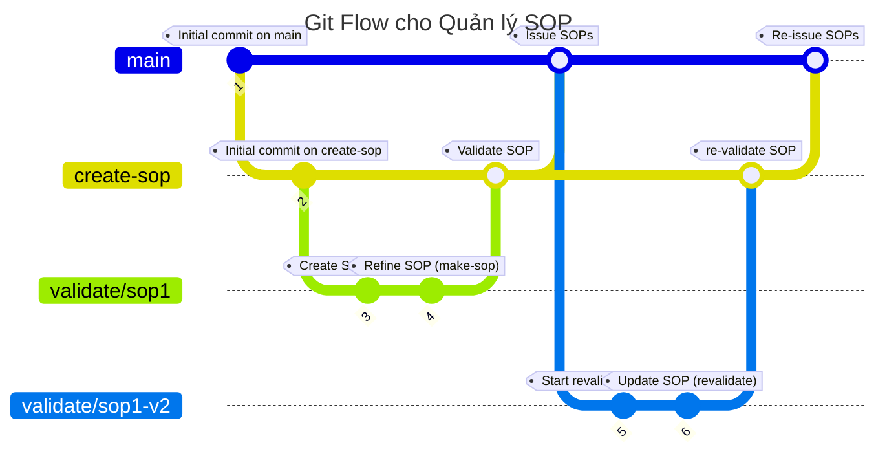

# SOP Managerment System

- Workflow

```mermaid

---
title: Git Flow cho Quản lý SOP
---

gitGraph
   commit id: "1" tag: "Initial commit on main"
   branch create-sop
   checkout create-sop
   commit id: "2" tag: "Initial commit on create-sop"
   branch validate/sop1
   checkout validate/sop1
   commit id: "3" tag: "Create SOP (make-sop)"
   commit id: "4" tag: "Refine SOP (make-sop)"
   checkout create-sop
   merge validate/sop1 tag: "Validate SOP"
   checkout main
   merge create-sop tag: "Issue SOPs"
   branch validate/sop1-v2
   checkout validate/sop1-v2
   commit id: "5" tag: "Start revalidation (revalidate)"
   commit id: "6" tag: "Update SOP (revalidate)"
   checkout create-sop
   merge validate/sop1-v2 tag: "re-validate SOP"
   checkout main
   merge create-sop tag: "Re-issue SOPs"

```